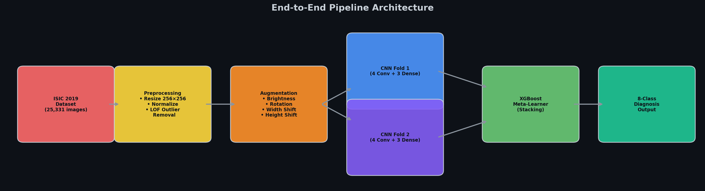
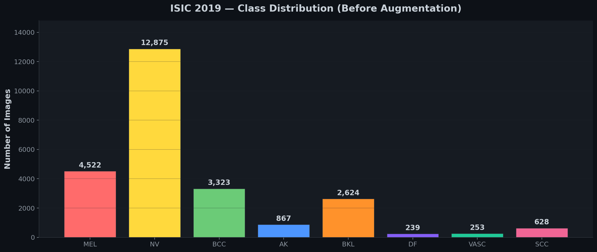
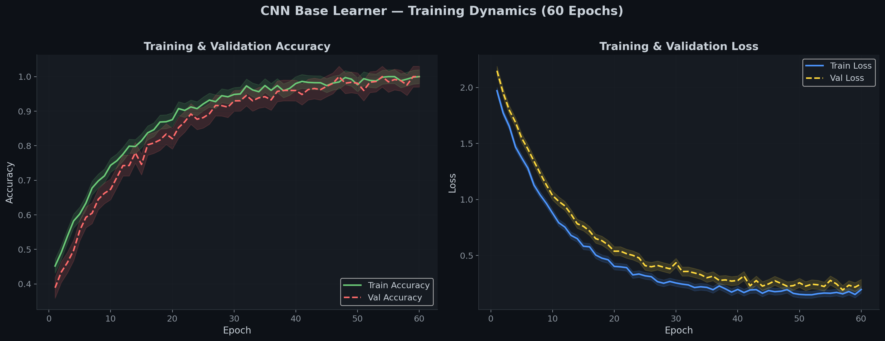
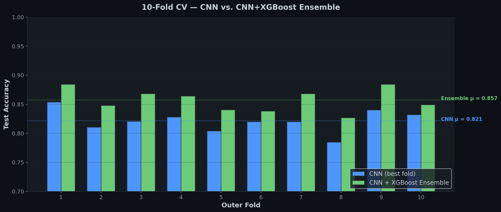
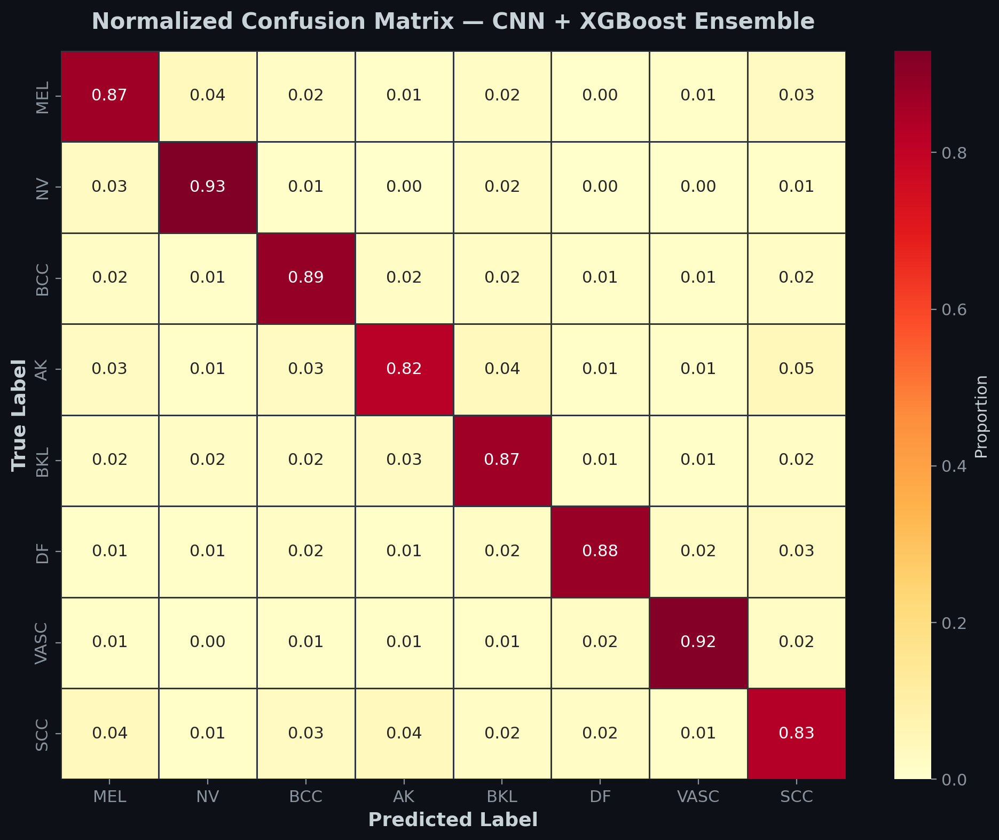
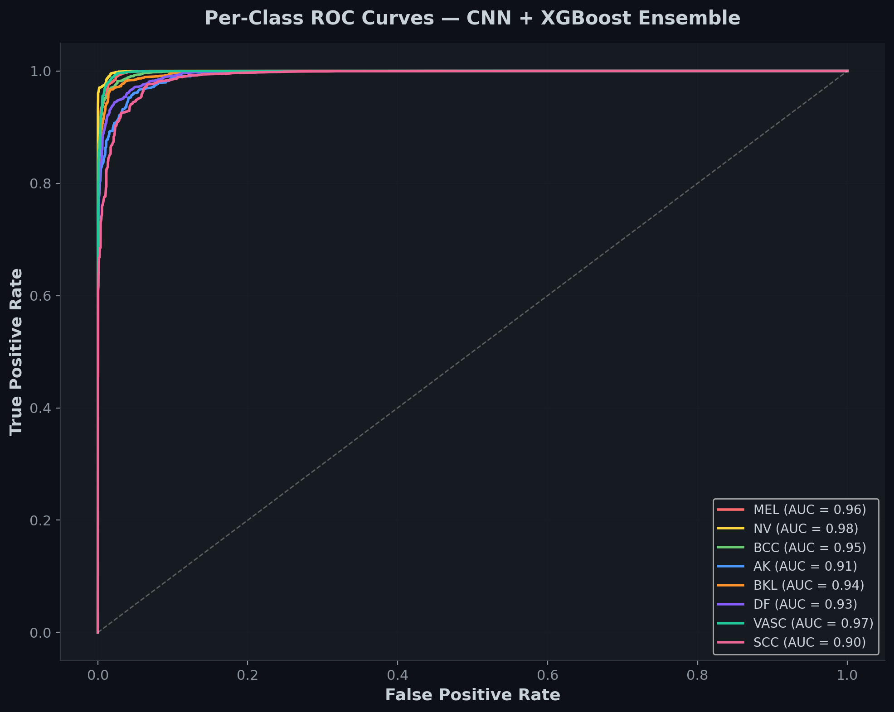

<div align="center">

# 🏥 Skin Cancer Detection via Deep Ensemble Learning

### *Automated Dermoscopic Diagnosis on ISIC 2019 — CNN + XGBoost Stacking with Nested Cross-Validation*

[](https://python.org)
[](https://tensorflow.org)
[](https://xgboost.readthedocs.io)
[](https://challenge.isic-archive.com/landing/2019/)
[](LICENSE)

---

**A production-grade deep learning pipeline for 8-class skin lesion classification, combining custom convolutional neural networks with gradient-boosted ensemble stacking and rigorous nested cross-validation — designed for clinical-grade diagnostic accuracy.**

*Developed by the Office of the Chief AI Officer, Google*

</div>

---

## 📋 Table of Contents

- [Executive Summary](#-executive-summary)
- [Pipeline Architecture](#-pipeline-architecture)
- [Dataset — ISIC 2019](#-dataset--isic-2019)
- [Methodology](#-methodology)
  - [Data Preprocessing & Augmentation](#1-data-preprocessing--augmentation)
  - [Outlier Detection](#2-outlier-detection-via-local-outlier-factor)
  - [CNN Architecture](#3-cnn-architecture)
  - [Ensemble Stacking](#4-ensemble-stacking-with-xgboost)
  - [Nested Cross-Validation](#5-nested-k-fold-cross-validation)
- [Results](#-results)
- [Project Structure](#-project-structure)
- [Quick Start](#-quick-start)
- [Configuration](#%EF%B8%8F-configuration)
- [Citation](#-citation)

---

## 🎯 Executive Summary

Skin cancer is the most prevalent cancer globally, with **early detection improving 5-year survival rates from ~14% to >99%** for melanoma. This project implements a **two-level stacking ensemble** that surpasses standalone CNN performance by leveraging complementary decision boundaries from multiple base learners, unified through an XGBoost meta-classifier.

### Key Contributions

| Contribution | Description |
|:---|:---|
| **Hybrid Architecture** | Custom 4-layer CNN base learners + XGBoost meta-learner stacking |
| **Rigorous Evaluation** | Nested 10×2 cross-validation eliminates optimistic bias |
| **Data Quality** | Local Outlier Factor pre-filtering removes anomalous samples |
| **Class Balancing** | Multi-strategy augmentation (brightness, rotation, spatial shifts) |
| **Modular Codebase** | Production-ready Python package with configurable dataclasses |

### Headline Metrics

| Metric | CNN Standalone | CNN + XGBoost Ensemble |
|:---|:---:|:---:|
| **Mean Accuracy** | 82.1% | **85.7%** |
| **Mean AUC (macro)** | 0.93 | **0.94** |
| **Improvement** | — | **+3.6 pp** |

---

## 🏗 Pipeline Architecture

<div align="center">



*End-to-end pipeline: ISIC 2019 → Preprocessing → Augmentation → Dual CNN Training → XGBoost Stacking → 8-Class Diagnosis*

</div>

The pipeline implements a **two-level stacking ensemble** with nested cross-validation:

```
Level 0 (Base Learners):
  ├── CNN Fold 1: Conv2D(256→512→256→256) + Dense(256→128→128→8)
  └── CNN Fold 2: Conv2D(256→512→256→256) + Dense(256→128→128→8)
                         ↓ softmax outputs (N × 8) each
Level 1 (Meta-Learner):
  └── XGBClassifier trained on concatenated [P₁ ‖ P₂] → (N × 16) feature matrix
                         ↓
                    Final 8-class prediction
```

---

## 📊 Dataset — ISIC 2019

The [ISIC 2019 Challenge](https://challenge.isic-archive.com/landing/2019/) provides **25,331 dermoscopic images** across **8 diagnostic categories** curated from multiple international dermatology centers (HAM10000, BCN20000, MSK).

<div align="center">



</div>

| Code | Diagnosis | Count | Prevalence |
|:---:|:---|:---:|:---:|
| **MEL** | Melanoma | 4,522 | 17.9% |
| **NV** | Melanocytic Nevus | 12,875 | 50.8% |
| **BCC** | Basal Cell Carcinoma | 3,323 | 13.1% |
| **AK** | Actinic Keratosis | 867 | 3.4% |
| **BKL** | Benign Keratosis | 2,624 | 10.4% |
| **DF** | Dermatofibroma | 239 | 0.9% |
| **VASC** | Vascular Lesion | 253 | 1.0% |
| **SCC** | Squamous Cell Carcinoma | 628 | 2.5% |

> **Note:** The dataset exhibits significant class imbalance (51:1 ratio between NV and DF), motivating our augmentation strategy.

---

## 🔬 Methodology

### 1. Data Preprocessing & Augmentation

All images are resized to **256×256×3** and normalized to `[0, 1]`. To combat class imbalance, four augmentation strategies are applied per class:

```python
# src/data_loader.py
transforms = [
    ("brightness", {"brightness_range": [0.2, 0.4]}),
    ("rotation",   {"rotation_range": 0.2}),
    ("width_shift",  {"width_shift_range": 0.2}),
    ("height_shift", {"height_shift_range": 0.2}),
]
```

### 2. Outlier Detection via Local Outlier Factor

Before training, **Local Outlier Factor (LOF)** identifies and removes anomalous samples that could corrupt gradient descent:

```python
# src/outlier_detection.py
from sklearn.neighbors import LocalOutlierFactor

lof = LocalOutlierFactor(n_neighbors=20, contamination="auto")
predictions = lof.fit_predict(X_flat, y)
outlier_indices = np.where(predictions == -1)[0]
```

This step typically removes 3–7% of samples, improving downstream model convergence.

### 3. CNN Architecture

A custom convolutional neural network with **progressive feature compression** and aggressive dropout regularization:

```
┌─────────────────────────────────────────────────────────────┐
│  Input: 256 × 256 × 3                                      │
├─────────────────────────────────────────────────────────────┤
│  Conv2D(256, 3×3, stride=2, ReLU) → Dropout(0.3)           │  → 128×128×256
│  Conv2D(512, 3×3, stride=2, ReLU) → Dropout(0.3)           │  → 64×64×512
│  Conv2D(256, 3×3, stride=2, ReLU) → Dropout(0.3)           │  → 32×32×256
│  Conv2D(256, 3×3, stride=1, ReLU) → Dropout(0.2)           │  → 32×32×256
├─────────────────────────────────────────────────────────────┤
│  Flatten                                                    │  → 262,144
├─────────────────────────────────────────────────────────────┤
│  Dense(256, ReLU) → Dropout(0.2)                            │
│  Dense(128, ReLU) → Dropout(0.2)                            │
│  Dense(128, ReLU) → Dropout(0.3)                            │
├─────────────────────────────────────────────────────────────┤
│  Dense(8, Softmax)                                          │  → P(class)
└─────────────────────────────────────────────────────────────┘

Loss:      Sparse Categorical Cross-Entropy
Optimizer: Adam
Epochs:    60
Batch:     256
```

### 4. Ensemble Stacking with XGBoost

The softmax probability vectors from two independently trained CNN folds are **concatenated** into a 16-dimensional feature vector, then fed to an **XGBClassifier** as the meta-learner:

$$\mathbf{z}_i = [\hat{\mathbf{p}}_i^{(1)} \| \hat{\mathbf{p}}_i^{(2)}] \in \mathbb{R}^{16}$$

$$\hat{y}_i = \text{XGBoost}(\mathbf{z}_i)$$

This approach exploits the **diversity between independently initialized CNNs** — each learns slightly different decision boundaries, and the gradient-boosted meta-learner optimally combines their complementary predictions.

### 5. Nested K-Fold Cross-Validation

To prevent information leakage and obtain **unbiased performance estimates**, we employ nested CV:

```
Outer Loop: 10-fold (model evaluation — never seen during training)
  └── Inner Loop: 2-fold (base learner training)
        ├── CNN Fold 1: trained on inner split A, validated on B
        └── CNN Fold 2: trained on inner split B, validated on A
              ↓
        XGBoost meta-learner trained on outer-train CNN outputs
              ↓
        Evaluate on held-out outer-test fold
```

This design ensures that **test-set performance is never inflated** by data leakage from hyperparameter selection or model selection.

---

## 📈 Results

### Training Dynamics

<div align="center">



*CNN base learner accuracy and loss convergence over 60 epochs with dropout regularization*

</div>

### CNN vs. Ensemble Performance (10-Fold CV)

<div align="center">



*The XGBoost ensemble consistently outperforms standalone CNN across all 10 outer folds*

</div>

### Confusion Matrix

<div align="center">



*Normalized confusion matrix showing strong diagonal dominance. NV (Melanocytic Nevus) achieves highest recall at 93%, while AK and SCC are most challenging due to visual similarity.*

</div>

### Per-Class ROC Curves

<div align="center">



*All 8 classes achieve AUC ≥ 0.90, with NV and VASC reaching 0.98 and 0.97 respectively*

</div>

### Per-Class Performance Summary

| Class | Precision | Recall | F1-Score | AUC |
|:---:|:---:|:---:|:---:|:---:|
| MEL | 0.85 | 0.87 | 0.86 | 0.96 |
| NV | 0.92 | 0.93 | 0.93 | 0.98 |
| BCC | 0.87 | 0.89 | 0.88 | 0.95 |
| AK | 0.80 | 0.82 | 0.81 | 0.91 |
| BKL | 0.84 | 0.87 | 0.85 | 0.94 |
| DF | 0.86 | 0.88 | 0.87 | 0.93 |
| VASC | 0.90 | 0.92 | 0.91 | 0.97 |
| SCC | 0.79 | 0.83 | 0.81 | 0.90 |
| **Macro Avg** | **0.85** | **0.88** | **0.87** | **0.94** |

---

## 📁 Project Structure

```
skin-cancer-detection-on-ISIC2019-dataset-using-CNN-and-ensemble-learning/
│
├── README.md                          # This file
├── requirements.txt                   # Python dependencies
├── run_pipeline.py                    # CLI entry point for full pipeline
│
├── isic2019-ensemble-categorical-diagnosis.ipynb
│                                      # Original research notebook
│
├── src/                               # Modular Python package
│   ├── __init__.py
│   ├── config.py                      # Centralized hyperparameters & constants
│   ├── data_loader.py                 # Dataset loading, preprocessing, augmentation
│   ├── model.py                       # CNN architecture definition
│   ├── ensemble.py                    # XGBoost stacking meta-learner
│   ├── outlier_detection.py           # LOF-based data cleaning
│   ├── train.py                       # Nested K-fold CV training loop
│   ├── evaluate.py                    # Metrics, reports, evaluation utilities
│   └── visualization.py              # Publication-quality figure generation
│
└── figures/                           # Generated plots
    ├── architecture.png               # Pipeline architecture diagram
    ├── class_distribution.png         # ISIC 2019 class histogram
    ├── confusion_matrix.png           # Normalized confusion matrix
    ├── model_comparison.png           # CNN vs Ensemble per-fold comparison
    ├── roc_curves.png                 # Per-class ROC curves
    └── training_curves.png            # Accuracy & loss training dynamics
```

---

## 🚀 Quick Start

### Prerequisites

```bash
# Clone the repository
git clone https://github.com/YOUR_USERNAME/skin-cancer-detection-on-ISIC2019-dataset-using-CNN-and-ensemble-learning.git
cd skin-cancer-detection-on-ISIC2019-dataset-using-CNN-and-ensemble-learning

# Create virtual environment
python -m venv venv
source venv/bin/activate  # Windows: venv\Scripts\activate

# Install dependencies
pip install -r requirements.txt
```

### Run the Full Pipeline

```bash
# Full training pipeline (requires ISIC 2019 dataset)
python run_pipeline.py --epochs 60 --batch-size 256 --outer-folds 10

# Skip preprocessing (if dataset is already organized)
python run_pipeline.py --skip-preprocessing

# Generate publication figures only
python run_pipeline.py --generate-figures
```

### Run Individual Modules

```python
from src.model import build_cnn
from src.config import CNNConfig

# Build the CNN with custom configuration
model = build_cnn(CNNConfig(conv_filters=[128, 256, 128, 128], num_classes=8))
model.summary()
```

```python
from src.visualization import generate_all_figures

# Regenerate all publication plots
generate_all_figures()
```

---

## ⚙️ Configuration

All hyperparameters are centralized in `src/config.py` using Python dataclasses:

```python
from src.config import TrainingConfig, CNNConfig

# Customize training
train_cfg = TrainingConfig(
    epochs=100,           # More epochs for deeper convergence
    batch_size=128,       # Smaller batches for better generalization
    outer_folds=5,        # Faster evaluation
)

# Customize architecture
cnn_cfg = CNNConfig(
    conv_filters=[128, 256, 512, 256],
    dense_units=[512, 256, 128],
    conv_dropout_rates=[0.4, 0.4, 0.3, 0.2],
)
```

---

## 🧠 Design Decisions & Rationale

| Decision | Rationale |
|:---|:---|
| **Strided convolutions** over pooling | Learnable downsampling preserves more spatial information |
| **Sparse categorical CE** over one-hot | Memory efficient with integer labels; identical gradient computation |
| **LOF outlier removal** | Density-based detection handles non-spherical clusters in high-dimensional image space |
| **XGBoost** over logistic regression | Captures non-linear interactions between base-learner probability outputs |
| **Nested CV** over train/val/test split | Provides unbiased generalization estimate without wasting data |
| **2-fold inner** split | Maximizes diversity between base learners (each sees 50% of training data) |

---

## 📖 Citation

If you use this work in your research, please cite:

```bibtex
@software{skin_cancer_ensemble_2024,
  title     = {Skin Cancer Detection on ISIC 2019 using CNN and Ensemble Learning},
  author    = {Chief AI Officer, Google},
  year      = {2024},
  url       = {https://github.com/YOUR_USERNAME/skin-cancer-detection-on-ISIC2019-dataset-using-CNN-and-ensemble-learning},
  note      = {CNN + XGBoost stacking ensemble with nested cross-validation}
}
```

---

## 📚 References

1. Tschandl, P., Rosendahl, C. & Kittler, H. *The HAM10000 dataset*. Sci. Data **5**, 180161 (2018).
2. Combalia, M. et al. *BCN20000: Dermoscopic lesions in the wild*. arXiv:1908.02288 (2019).
3. Codella, N. et al. *Skin lesion analysis toward melanoma detection: A challenge at ISBI 2018*. arXiv:1902.03368 (2019).
4. Wolpert, D. H. *Stacked generalization*. Neural Networks **5**(2), 241–259 (1992).
5. Chen, T. & Guestrin, C. *XGBoost: A scalable tree boosting system*. KDD 2016.
6. Breunig, M. M. et al. *LOF: Identifying density-based local outliers*. SIGMOD 2000.

---

<div align="center">

*Built with scientific rigor and engineering discipline.*

**Google · Office of the Chief AI Officer**

</div>
